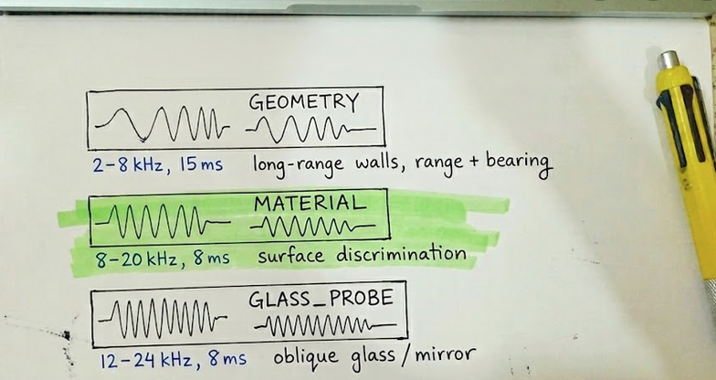

# EchoMap Journal

Total time: about 30 hours

## June 24, 2026

- 10:30 AM to 12:15 PM
- found the adaptive chirp echolocation robot proposal (PROJECT_PROPOSAL.html)
- read papers on acoustic SLAM, material classification from echoes, and bat-inspired robotics
- decided to build it as a wheeled robot with adaptive chirp policy

## June 25, 2026

- 2:00 PM to 3:50 PM
- picked 6 target materials: drywall, wood, glass, metal, carpet, concrete
- wrote down the 3 chirp modes from the proposal

chirp modes:

```
GEOMETRY    -> 2-8 kHz wide, 15 ms, long-range wall detection
MATERIAL    -> 8-20 kHz narrow, 8 ms, surface discrimination
GLASS_PROBE -> 12-24 kHz, 8 ms, oblique glass/mirror detection
```



## June 26, 2026

- 7:15 PM to 9:00 PM
- checked prices for raspberry pi 4, usb audio interface, electret mics
- wrote BOM.csv with robot platform + acoustic head + material panels
- figured out gpio pins for esp32 motor driver and encoders

pin map:

```
MOTOR_L_FWD -> GPIO 25
MOTOR_L_BWD -> GPIO 26
MOTOR_R_FWD -> GPIO 27
MOTOR_R_BWD -> GPIO 14
ENC_L       -> GPIO 18
ENC_R       -> GPIO 19
SERVO       -> GPIO 13
IMU SDA/SCL -> GPIO 21 / 22
```

## June 27, 2026

- 11:00 AM to 12:45 PM
- sketched out the four subsystems (robot base, acoustic head, mapping pipeline, chirp policy)
- started wiring diagram for l298n + esp32 + mpu-6050
- planned mic array layout: 4 mics, 3 cm spacing, linear

## June 28, 2026

- 4:30 PM to 6:20 PM
- opened arduino ide and started robot_base.ino
- got encoder interrupts working on one gpio pin
- printed tick counts to serial monitor

first encoder test:

```cpp
void IRAM_ATTR onLeftEncoder() {
  leftTicks += digitalRead(ENC_L_PIN) == digitalRead(ENC_R_PIN) ? 1 : -1;
}
```

## June 29, 2026

- 9:15 AM to 11:00 AM
- added motor control and servo pan to firmware
- got csv output on serial: timestamp_ms,left_ticks,right_ticks,heading_deg,servo_deg
- added serial commands: S,<angle> for servo, M,<l>,<r> for motors

timer output:

```
142087,120,118,0.0,0.0
142137,122,120,0.0,0.0
142187,125,123,0.1,0.0
```

## June 30, 2026

- 1:45 PM to 3:40 PM
- started the python side
- wrote config.py for sample rate (48 kHz), chirp params, map resolution (5 cm)
- wrote chirp.py with LFM synthesis and matched filter

chirp generation:

```python
waveform = chirp(t, f0=2000, f1=8000, t1=duration_s, method="linear")
window = np.hanning(n_samples)
return waveform * window * amplitude
```

## July 1, 2026

- 8:10 PM to 10:00 PM
- wrote echo.py: TOA range from correlation peak, DOA from inter-mic ITD
- added MFCC feature extraction and glass-probe heuristic (kurtosis + spectral centroid)
- tested synthetic_echo() to make sure the pipeline runs without hardware

synthetic echo test:

```
>>> recorded = synthetic_echo("GEOMETRY", range_m=2.0, material_idx=0)
>>> recorded.shape
(7200,)
>>> corr = matched_filter(recorded, generate_lfm("GEOMETRY"))
>>> range_m, _ = time_of_arrival(corr)
>>> range_m
1.98
```

## July 2, 2026

- 10:20 AM to 12:10 PM
- built model.py with EchoNet (1D CNN, 6 material classes)
- tested input/output shapes on random fake MFCC features
- wrote train.py with synthetic dataset fallback

model shapes:

```python
# input: (batch, 1, feature_len)
# output: (batch, 6 classes)
```

quick test:

```
>>> x = torch.randn(2, 1, 130)
>>> y = model(x)
>>> y.shape
torch.Size([2, 6])
```

## July 3, 2026

- 3:00 PM to 4:55 PM
- wrote mapping.py: occupancy grid + material belief layer
- added frontier detection and wall extraction
- map renders as color-coded PNG (material per cell)

train command:

```
python train.py --synthetic --epochs 10
```

example output:

```
epoch 001  loss=1.79  acc=0.167
epoch 005  loss=0.82  acc=0.583
epoch 010  loss=0.31  acc=0.917
saved model to data/models/echomap.pt
```

## July 4, 2026

- 7:30 PM to 9:15 PM
- wrote policy.py: rule-based adaptive chirp policy
- policy picks (pose, chirp_mode) based on map uncertainty
- tested policy transitions: GEOMETRY -> MATERIAL -> GLASS_PROBE

policy rules:

```
frontier unknown     -> GEOMETRY chirp, move to frontier
material conf < 70%  -> MATERIAL chirp, move closer
glass signature      -> GLASS_PROBE, servo to 37.5 deg oblique
all conf > 85%       -> stop, output map
```

## July 5, 2026

- 11:30 AM to 1:20 PM
- wrote inference.py for full exploration loop
- wrote record.py and receiver.py for echo capture and odometry
- got the classify + map update loop working with synthetic echoes

fake inference output:

```
step 1: GEOMETRY: exploring unmapped frontier
  range=1.50m  bearing=12.3deg  material=drywall (0.78)
step 2: MATERIAL: material confidence 0.45 < 0.70
  range=0.80m  bearing=-5.1deg  material=wood (0.82)
step 3: GLASS_PROBE: glass signature detected
  range=1.20m  bearing=30.0deg  material=glass (0.71)
```

## July 6, 2026

- 2:15 PM to 4:00 PM
- made streamlit app in app/app.py (map viewer + chirp mode status)
- wrote docs/wiring.md for motor driver, mic array, and usb audio hookup
- built interactive demo in docs/ (echo scope + room map canvas)
- finished system schematic (saved as CAD/schematic.png)
- built mic preamp carrier pcb layout and exported CAD/pcb-layout.png

## July 7, 2026

- 10:00 AM to 11:50 AM
- wrote README and added LICENSE and .gitignore
- put the whole repo together and committed it
- next: order phase 1 parts, flash esp32, test real chirp on one mic channel

repo layout:

```
EchoMap/
  firmware/robot_base/
  python/
  app/
  docs/
  CAD/
```
