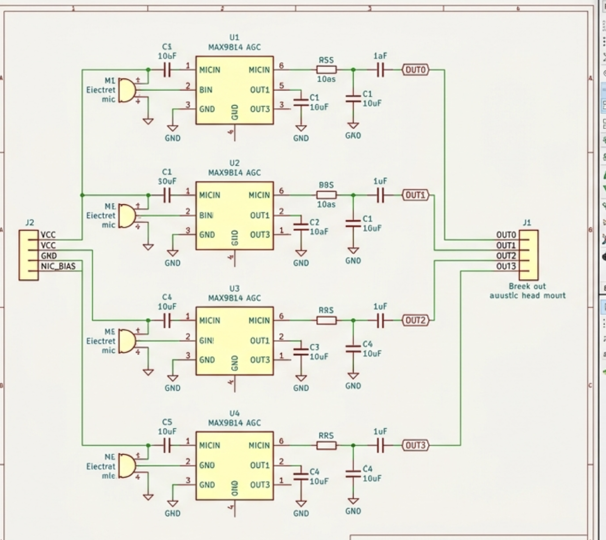
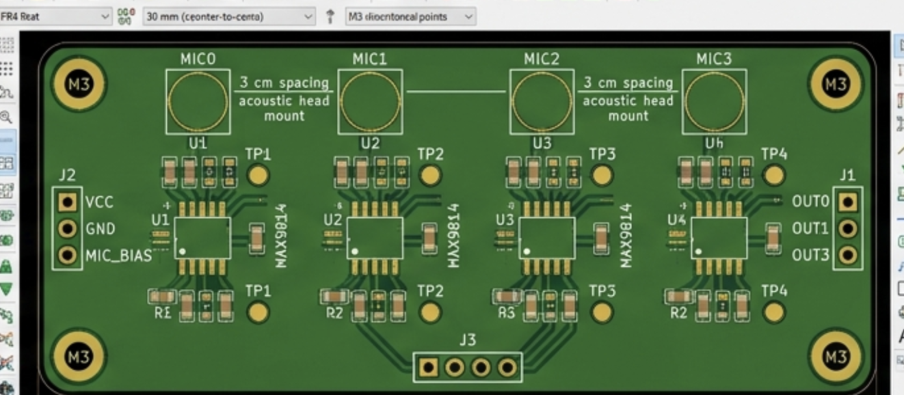
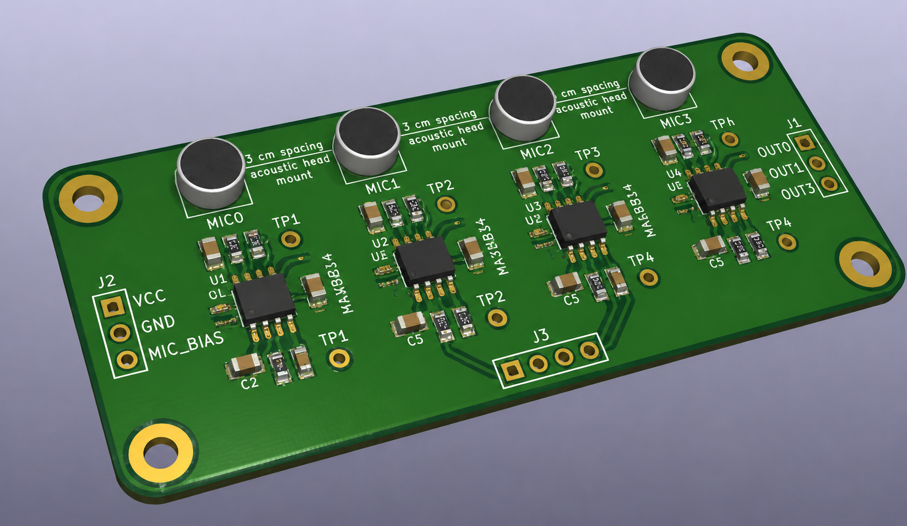

# EchoMap

> Wheeled robot that maps rooms and labels wall materials with adaptive acoustic chirps.

**Demo:** [larped-gpu.github.io/echo-map](https://larped-gpu.github.io/echo-map) - interactive echo scope + room map simulator

## What is this?

EchoMap drives around a room, emits chirps through a small speaker, and records echoes on a 4-mic array. A Raspberry Pi runs matched-filter ranging, material classification, and mapping. An ESP32 handles motors, encoders, IMU, and servo pan. The policy switches between three chirp modes based on map uncertainty.

Inspired by bat FM/CF call switching and acoustic SLAM / material-from-echo work (ActiveRIR, EchoScan).

## Features

- 3 adaptive LFM chirp modes (geometry, material, glass-probe)
- 4-mic linear array at 48 kHz
- Matched-filter TOA + inter-mic DOA
- EchoNet 1D CNN (6 material classes)
- Occupancy + material map (5 cm cells)
- Rule-based adaptive chirp policy
- ESP32 base with encoders, IMU, servo pan head
- Synthetic-echo mode for testing without hardware

## Chirp modes

| Mode | Freq range | Goal |
|------|-----------|------|
| GEOMETRY | 2-8 kHz | Wall range + bearing |
| MATERIAL | 8-20 kHz | Surface type |
| GLASS-PROBE | 12-24 kHz | Glass/mirror at oblique angle |

## Materials

| drywall | wood | glass |
|---------|------|-------|
| metal | carpet | concrete |

## Hardware design

PCB exports in [`CAD/`](CAD/) (schematic, layout, 3D render). Editable Fusion CAD (`.f3d` / `.f3z`) + STEP pack in [`CAD/`](CAD/).

| Schematic | PCB layout | 3D render |
|-----------|------------|-----------|
|  |  |  |

## BOM

Download [BOM.csv](BOM.csv). Columns: Component, Qty, Price_USD, Link, Phase.

**Total: $325**

## Wiring


| Component | Connection | Pin / Port |
|-----------|------------|------------|
| L298N left motor | PWM fwd/bwd | GPIO 25 / 26 |
| L298N right motor | PWM fwd/bwd | GPIO 27 / 14 |
| Wheel encoders | digital interrupt | GPIO 18 / 19 |
| SG90 servo (pan head) | PWM | GPIO 13 |
| MPU-6050 IMU | I2C | SDA 21 / SCL 22 |
| USB audio interface | USB | Pi USB port |
| 4x electret mics | preamp to ADC | USB audio line in |
| Speaker + PAM8403 amp | DAC to amp to speaker | USB audio line out |

See [docs/wiring.md](docs/wiring.md) for full hookup and bench-test setup.

## Quick start

### Demo site (GitHub Pages)

Static demo lives in [`docs/`](docs/). Deployed by GitHub Actions (`.github/workflows/pages.yml`).

One-time setup: **Settings → Pages → Source → GitHub Actions**.

Live URL: `https://larped-gpu.github.io/echo-map/`

### Firmware

1. Open `firmware/robot_base/robot_base.ino` in Arduino IDE.
2. Board: **ESP32 Dev Module**.
3. Flash. Open Serial Monitor at **115200** baud.
4. CSV output: `timestamp_ms,left_ticks,right_ticks,heading_deg,servo_deg`

Set `USE_WIFI 1` in the sketch for UDP odometry streaming.

### Python

```bash
cd python
pip install -r requirements.txt
python train.py --synthetic --epochs 20
python inference.py --synthetic --steps 30
```

### App

```bash
streamlit run app/app.py
```

## Repo layout

```
EchoMap/
├── README.md
├── JOURNAL.md
├── BOM.csv
├── firmware/robot_base/
├── python/
├── app/
├── CAD/
└── docs/
```

## License

MIT. See [LICENSE](LICENSE).
