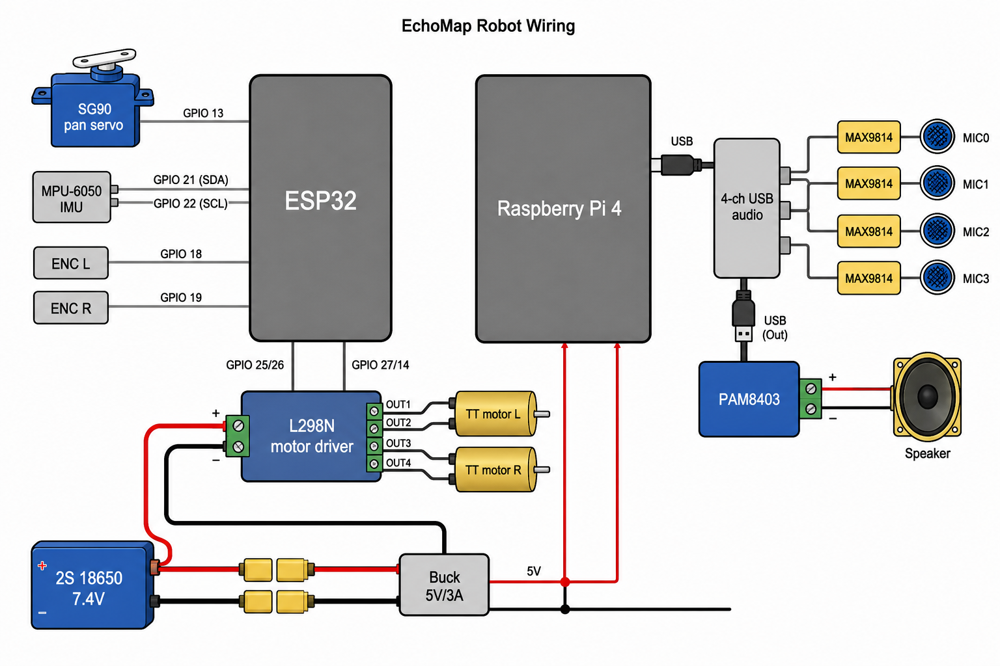

# Wiring



## Robot base (ESP32)

| Component | Wire | ESP32 GPIO |
|-----------|------|------------|
| L298N IN1 (left fwd) | PWM | GPIO 25 |
| L298N IN2 (left bwd) | PWM | GPIO 26 |
| L298N IN3 (right fwd) | PWM | GPIO 27 |
| L298N IN4 (right bwd) | PWM | GPIO 14 |
| Left encoder A | digital | GPIO 18 |
| Right encoder A | digital | GPIO 19 |
| SG90 servo signal | PWM | GPIO 13 |
| MPU-6050 SDA | I2C | GPIO 21 |
| MPU-6050 SCL | I2C | GPIO 22 |

## Acoustic head (Raspberry Pi)

| Component | Connection | Pi |
|-----------|------------|-----|
| USB audio interface (4-channel, 48 kHz) | USB | USB port |
| Speaker driver (2-3") | amp out → speaker | via PAM8403 |
| PAM8403 amp input | DAC L/R | USB audio line out |
| Electret mic × 4 | preamp out → ADC | USB audio line in (via MAX9814) |
| MAX9814 preamp × 4 | mic in → gain out | between mics and USB audio |
| SG90 servo (pan head) | signal | Pi GPIO 12 (or ESP32 GPIO 13) |

## Mic array layout

Linear array, 3 cm spacing, mounted on acoustic head:

```
  [mic0] --- 3cm --- [mic1] --- 3cm --- [mic2] --- 3cm --- [mic3]
                         |
                    [speaker]
                         |
                    [servo pivot]
```

## Bench test without robot

Connect USB audio to laptop/Pi, run chirp playback + recording:

```bash
python python/record.py --material drywall --synthetic
python python/train.py --synthetic
python python/inference.py --synthetic
```

## Power

- 18650 2-cell pack (7.4V) → L298N motor supply
- Buck converter (5V/3A) → Raspberry Pi
- Shared GND between Pi, ESP32, and motor driver
